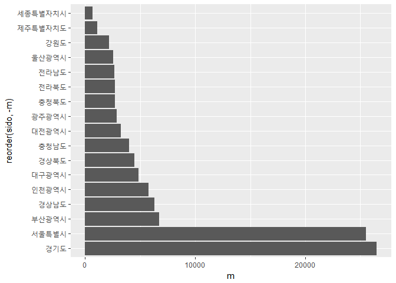
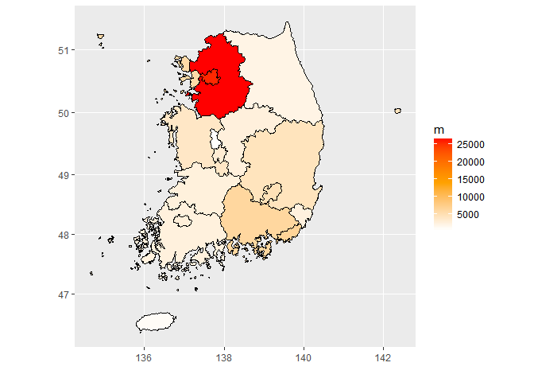
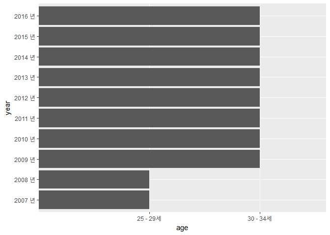
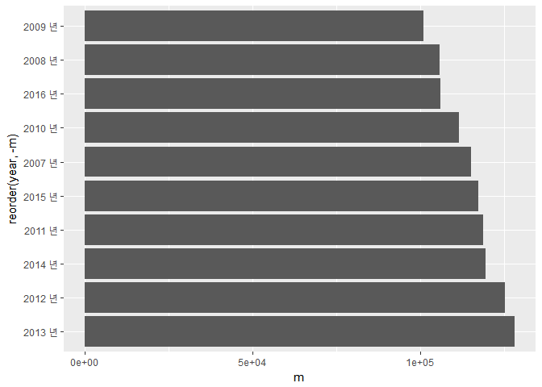
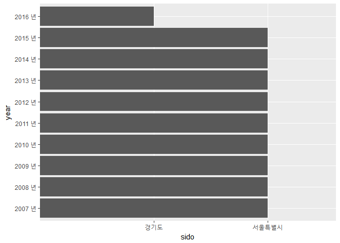
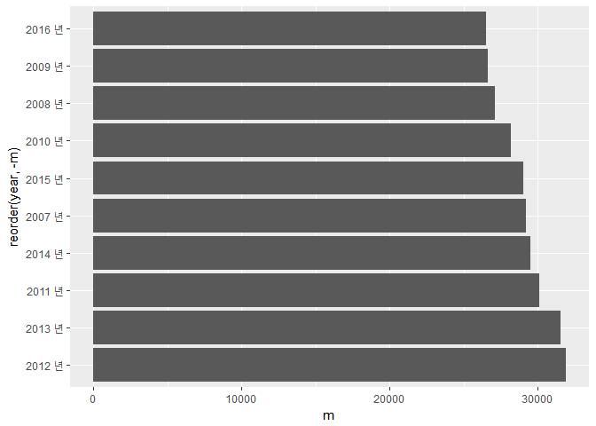
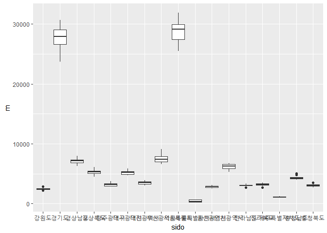

남편의 초혼연령대 분석
================
김세영
2017년 11월 30일

초록
====

이 연구의 목적은 '초혼 건수를 연도별, 지역별, 연령별의 다양한 시각으로 접근'하는 것이다. 연구에 사용된 자료는 국가통계포털에 공개된 '시도/초혼연령별 혼인'자료이다. 실증분석자료는 8개의 광역시(서울특별시, 부산광역시, 인천광역시, 대구광역시, 대전광역시, 광주광역시, 울산광역시, 세종특별자치시)와 9개의 도(경기도, 경상남도, 경상북도, 충청남도, 충청북도, 전라남도, 전라북도, 강원도, 제주특별자치도)를 표본으로 2007년-2016년의 10개년 통계자료를 통합하여 구축되었다. 또한 지역별로 연도별, 연령별의 다양한 데이터를 사용했다. 서론의 분석에서는 분석에 필요한 패키지를 불러오며 본격적인 분석에 앞서 데이터를 검토 및 전처리를 할 것이다. 이러한 데이터를 바탕으로, 본론의 분석에서는 '남편의 혼인건이 제일 많은 연령대'를 2016년 전국으로 한정지어 분석하였고, '지역별 남편 혼인건이 제일 많은 연령대'를 2016년으로 한정지어 분석했다. 이를 통해 남편은 30-34세에 혼인건이 제일 많은 것과 인구가 많은 지역이 혼인건수도 많다는 것을 확인할 것이다. 마지막으로 앞에서 분석한 내용들이 근 10년간 어떤 변화가 있는지를 분석하여 혼인연령의 상승과 혼인건수가 하락세임을 확인할 것이다.

서론
====

분석 주제
---------

1인가구 증가로 인해 혼인율이 감소하는 추세인 현재, 근 10년간 연령별 혼인건수에 대해 어떤 변화가 있었는지에 대한 궁금증으로 데이터를 선정했다. 전국의 평균 혼인건수로 어떤 연령대에 혼인을 제일 많이 하는지를 알아보며 여기에 지역, 연도라는 변수를 추가하여 이들이 혼인연령에 어떠한 영향을 미치는가를 알아볼 것이다.

데이터선정
----------

### 1)데이터 선정이유

분석초보인 필자는 '혼인'이라는 키워드가 비교적 가볍게 다가왔기 때문에 이 데이터를 선정했다. 이와 더불어 비용등의 문제로 결혼을 기피하게 되는 현재에 남편의 초혼의 연령대가 지역별, 년도별로 어떻게 변화하는지에 대한 궁금증을 해소하기 위해 이를 분석하기로 결정했다.

### 2)데이터 소개

구축된 데이터는 국가통계포털에서 공개된 '시도/초혼연령별 혼인'자료이다. 세부 내용으로는 시도별, 연령별, 시점, 남편, 아내이다.
필요한 데이터와 패키지를 불러온다.

``` r
library(dplyr)
```

    ## 
    ## Attaching package: 'dplyr'

    ## The following objects are masked from 'package:stats':
    ## 
    ##     filter, lag

    ## The following objects are masked from 'package:base':
    ## 
    ##     intersect, setdiff, setequal, union

``` r
library(ggplot2)
marriage <- read.csv("marriage_csv.csv")
```

데이터 속성을 파악하고 결측치가 없는지 확인한다.

``` r
str(marriage)
```

    ## 'data.frame':    3440 obs. of  5 variables:
    ##  $ 시도별: Factor w/ 22 levels "강원도","경기도",..: 17 17 17 17 17 17 17 17 17 17 ...
    ##  $ 연령별: Factor w/ 16 levels "15 - 19세","15세 미만",..: 15 15 15 15 15 15 15 15 15 15 ...
    ##  $ 시점  : Factor w/ 10 levels "2007 년","2008 년",..: 1 2 3 4 5 6 7 8 9 10 ...
    ##  $ 남편  : int  285413 270236 255751 272972 277369 275897 273789 257906 256372 238054 ...
    ##  $ 아내  : int  280738 264469 250674 268541 272551 270495 268422 251477 249978 232446 ...

``` r
table(is.na(marriage))
```

    ## 
    ## FALSE 
    ## 17200

변수명을 영문명으로 변경한다.(뒤에서 그래프로 표현하는 것을 대비해서)

``` r
marriage <- rename(marriage,  sido = 시도별, age = 연령별, year = 시점, m = 남편,  w = 아내)
str(marriage)
```

    ## 'data.frame':    3440 obs. of  5 variables:
    ##  $ sido: Factor w/ 22 levels "강원도","경기도",..: 17 17 17 17 17 17 17 17 17 17 ...
    ##  $ age : Factor w/ 16 levels "15 - 19세","15세 미만",..: 15 15 15 15 15 15 15 15 15 15 ...
    ##  $ year: Factor w/ 10 levels "2007 년","2008 년",..: 1 2 3 4 5 6 7 8 9 10 ...
    ##  $ m   : int  285413 270236 255751 272972 277369 275897 273789 257906 256372 238054 ...
    ##  $ w   : int  280738 264469 250674 268541 272551 270495 268422 251477 249978 232446 ...

필요없는 데이터를 필터링하여 복사본을 만든다.

``` r
kmarriage <- marriage %>%
  filter(sido != "읍부" & sido != "면부" & sido != "동부" & sido != "국외" & age != "계" & age != "미상") %>%
  select(-w)
```

본론
====

#### \[1\]전국적으로 남녀 혼인건이 제일 많은 연령대를 구하기

통합된 전국의 데이터에서 연도를 2016년으로 한정지어 남녀 혼인건수가 제일 많은 연령대를 구하였다. 전국적으로는 30-34세에 혼인건수가 제일 많은 것으로 나타났다.

``` r
kmarriage %>%
  filter(sido == "전국" & year == "2016 년") %>% 
  arrange(desc(m)) %>% 
  head(1)
```

    ##   sido       age    year      m
    ## 1 전국 30 - 34세 2016 년 106096

#### \[2\]지역별로 남녀 혼인건이 제일 많은 연령대를 구하기

연도를 2016년으로 한정지어 지역별로 어떤 연령대의 혼인건수가 제일 많은지 알아보았다. 그 결과 경기도, 서울특별시, 부산광역시, 경상남도, 인천광역시, 대구광역시, 경상북도, 충청남도, 대전광역시, 충청북도, 전라북도, 전라남도, 울산광역시, 강원도, 제주특별자치도, 세종특별자치시순으로 혼인건수가 많은 것으로 나타났고 이 안에서도 모든 지역에서 30-34세에 혼인건수가 제일 많은 것으로 나타났다.

``` r
kmarriage %>% 
  filter(sido != "전국" & year == "2016 년" ) %>% 
  group_by(sido) %>% 
  summarise(max_m = max(m)) %>%
  arrange(desc(max_m))
```

    ## # A tibble: 17 x 2
    ##              sido max_m
    ##            <fctr> <dbl>
    ##  1         경기도 26511
    ##  2     서울특별시 25501
    ##  3     부산광역시  6699
    ##  4       경상남도  6280
    ##  5     인천광역시  5781
    ##  6     대구광역시  4856
    ##  7       경상북도  4502
    ##  8       충청남도  3977
    ##  9     대전광역시  3256
    ## 10     광주광역시  2850
    ## 11       충청북도  2701
    ## 12       전라북도  2686
    ## 13       전라남도  2661
    ## 14     울산광역시  2573
    ## 15         강원도  2199
    ## 16 제주특별자치도  1112
    ## 17 세종특별자치시   673

``` r
km1 <-  kmarriage %>% 
  select(sido, age, m) %>% 
  filter(m == 26511 | m == 25501 | m == 6699 | m == 6280 | m == 5781 | m == 4856 | m == 4502 | m == 3977 | m == 3256 | m == 2850 | m == 2701 | m == 2686 | m == 2661 | m == 2573 | m == 2199 | m == 1112 | m == 673 & age!= "40 - 44세") %>% 
  arrange(desc(m))
km1
```

    ##              sido       age     m
    ## 1          경기도 30 - 34세 26511
    ## 2      서울특별시 30 - 34세 25501
    ## 3      부산광역시 30 - 34세  6699
    ## 4        경상남도 30 - 34세  6280
    ## 5      인천광역시 30 - 34세  5781
    ## 6      대구광역시 30 - 34세  4856
    ## 7        경상북도 30 - 34세  4502
    ## 8        충청남도 30 - 34세  3977
    ## 9      대전광역시 30 - 34세  3256
    ## 10     광주광역시 30 - 34세  2850
    ## 11       충청북도 30 - 34세  2701
    ## 12       전라북도 30 - 34세  2686
    ## 13       전라남도 30 - 34세  2661
    ## 14     울산광역시 30 - 34세  2573
    ## 15         강원도 30 - 34세  2199
    ## 16 제주특별자치도 30 - 34세  1112
    ## 17 세종특별자치시 30 - 34세   673

위에서 분석한 코드를 가독성을 위해 빈도표 및 그래프로 표현한다. 초혼연령대를 나타내는 빈도표에서는 위에서 분석했듯이 30-34세에 모든 지역이 초혼건수가 제일 많았던 것을 한 눈에 볼 수 있다. 막대그래프로도 위와 마찬가지다. 초혼의 건수를 나타내는 막대그래프는 경기도와 서울이 초혼건수가 압도적으로 많다는 것을 보여준다.

``` r
table(km1$age)
```

    ## 
    ## 15 - 19세 15세 미만 20 - 24세 25 - 29세 30 - 34세 35 - 39세 40 - 44세 
    ##         0         0         0         0        17         0         0 
    ## 45 - 49세 50 - 54세 55 - 59세 60 - 64세 65 - 69세 70 - 74세 75세 이상 
    ##         0         0         0         0         0         0         0 
    ##        계      미상 
    ##         0         0

``` r
ggplot(data = km1, aes(x= sido, y = age)) + geom_col() + coord_flip()
```


``` r
ggplot(data = km1, aes(x= reorder(sido, -m), y = m)) + geom_col() + coord_flip()
```



좀 더 가독성을 높이기 위해 대한민국 시도별 혼인건수 단계 구분도를 만든다.

``` r
library(ggiraphExtra)
library(kormaps2014)

km1[ ,1] <- c("Gyeonggi-do", "Seoul", "Busan", "Gyeongsangnam-do", "Incheon", "Daegu", "Gyeongsangbuk-do", "Chungcheongnam-do", "Daejeon", "Gwangju", "Chungcheongbuk-do", "Jeollabuk-do", "Jeollanam-do", "Ulsan", "Gangwon-do", "Jeju-do", "Sejong")

x <- data.frame(code = c(11, 21:26, 29, 31:39),
                sido = c("Seoul", "Busan", "Daegu", "Incheon", "Gwangju", "Daejeon", "Ulsan", "Sejong", "Gyeonggi-do", "Gangwon-do", "Chungcheongbuk-do", "Chungcheongnam-do", "Jeollabuk-do", "Jeollanam-do", "Gyeongsangbuk-do", "Gyeongsangnam-do", "Jeju-do"))

art <- left_join(km1, x, by = "sido")
```

    ## Warning: Column `sido` joining character vector and factor, coercing into
    ## character vector

``` r
str(changeCode(kormap1))
```

    ## 'data.frame':    8831 obs. of  15 variables:
    ##  $ id       : chr  "0" "0" "0" "0" ...
    ##  $ long     : chr  "137.774352627938" "137.779270931415" "137.780545929866" "137.814504843261" ...
    ##  $ lat      : chr  "50.6883045072662" "50.6899249663447" "50.6900586920365" "50.6937941360883" ...
    ##  $ order    : chr  "1" "2" "3" "4" ...
    ##  $ hole     : chr  "FALSE" "FALSE" "FALSE" "FALSE" ...
    ##  $ piece    : chr  "1" "1" "1" "1" ...
    ##  $ group    : chr  "0.1" "0.1" "0.1" "0.1" ...
    ##  $ SP_ID    : chr  "0" "0" "0" "0" ...
    ##  $ SIDO_CD  : chr  "11" "11" "11" "11" ...
    ##  $ SIDO_NM  : chr  NA NA NA NA ...
    ##  $ BASE_YEAR: chr  "2014" "2014" "2014" "2014" ...
    ##  $ name     : chr  "서울특별시" "서울특별시" "서울특별시" "서울특별시" ...
    ##  $ name1    : chr  NA NA NA NA ...
    ##  $ region   : chr  "11" "11" "11" "11" ...
    ##  $ code     : chr  "11" "11" "11" "11" ...

``` r
str(changeCode(art))
```

    ## 'data.frame':    17 obs. of  4 variables:
    ##  $ sido: chr  "Gyeonggi-do" "Seoul" "Busan" "Gyeongsangnam-do" ...
    ##  $ age : chr  NA NA NA NA ...
    ##  $ m   : chr  "26511" "25501" "6699" "6280" ...
    ##  $ code: chr  "31" "11" "21" "38" ...

``` r
ggChoropleth(data = art,
             aes(fill = m,
                 map_id = code,
                 tooltip = sido),
             map = kormap1,
             interactive = F)
```



#### \[3\]근 10년간 어떠한 양상으로 나타나는가

##### 1.근 10년간의 전국적인 남녀 혼인건이 제일 많은 연령대를 구하기

통합된 전국의 데이터를 이번에는 연도를 한정짓지 않고 근 10년을 기준으로 남녀 혼인건수가 제일 많은 연령대를 구하였다. 근 10년간 전국적으로 혼인건수가 30-34세에 제일 많이 나타나는 현상이 8개년에서 나타났다. 2007년과 2008년에는 25-29세에 혼인건수가 제일 많은 것을 알 수 있다.

``` r
kmarriage %>% 
  filter(sido == "전국") %>% 
  group_by(year) %>% 
  summarise(max_m = max(m)) %>%
  arrange(desc(max_m))
```

    ## # A tibble: 10 x 2
    ##       year  max_m
    ##     <fctr>  <dbl>
    ##  1 2013 년 128037
    ##  2 2012 년 125180
    ##  3 2014 년 119565
    ##  4 2011 년 118650
    ##  5 2015 년 117335
    ##  6 2007 년 115080
    ##  7 2010 년 111457
    ##  8 2016 년 106096
    ##  9 2008 년 105758
    ## 10 2009 년 101049

``` r
km2 <- kmarriage %>% 
  select(year, age, m) %>% 
  filter(m == 128037 | m == 125180 | m == 119565 | m == 118650 | m == 117335 | m == 115080 | m == 111457 | m == 106096 | m == 105758 | m == 101049) %>%
  arrange(desc(m))
km2
```

    ##       year       age      m
    ## 1  2013 년 30 - 34세 128037
    ## 2  2012 년 30 - 34세 125180
    ## 3  2014 년 30 - 34세 119565
    ## 4  2011 년 30 - 34세 118650
    ## 5  2015 년 30 - 34세 117335
    ## 6  2007 년 25 - 29세 115080
    ## 7  2010 년 30 - 34세 111457
    ## 8  2016 년 30 - 34세 106096
    ## 9  2008 년 25 - 29세 105758
    ## 10 2009 년 30 - 34세 101049

위에서 분석한 코드를 가독성을 위해 빈도표 및 그래프로 표현한다. 초혼연령대를 나타내는 빈도표에서는 위에서 분석했듯이 30-34세에 빈도가 8로 가장 많은 것을 볼 수 있고 25-29세에 빈도가 2임을 볼 수 있다. 막대그래프로도 위와 마찬가지다. 막대그래프로 봤을 때 2008년 이후로 혼인연령이 30-34세로 상승했음을 확인할 수 있다. 초혼의 건수를 나타내는 막대그래프는 근 10년간 전국의 혼인건수가 하락세임을 나타낸다.

``` r
table(km2$age)
```

    ## 
    ## 15 - 19세 15세 미만 20 - 24세 25 - 29세 30 - 34세 35 - 39세 40 - 44세 
    ##         0         0         0         2         8         0         0 
    ## 45 - 49세 50 - 54세 55 - 59세 60 - 64세 65 - 69세 70 - 74세 75세 이상 
    ##         0         0         0         0         0         0         0 
    ##        계      미상 
    ##         0         0

``` r
ggplot(data = km2, aes(x= year, y = age)) + geom_col() + coord_flip()
```



``` r
ggplot(data = km2, aes(x= reorder(year, -m), y = m)) + geom_col() + coord_flip()
```



##### 2.근 10년간 지역별 남녀 혼인건이 제일 많은 지역 구하기

연도를 한정짓지 않고 지역별로 근 10년을 기준으로 남녀 혼인건수가 제일 많은 지역을 구하였다. 근 10년간 서울특별시에서 30-34세에 혼인건수가 제일 많았고 2016년에만 경기도에서 30-34세에 혼인건수가 제일 많은 것을 확인 할 수 있다.

``` r
kmarriage %>% 
  filter(sido != "전국" ) %>% 
  group_by(year) %>% 
  summarise(max_m = max(m)) %>%
  arrange(desc(max_m))
```

    ## # A tibble: 10 x 2
    ##       year max_m
    ##     <fctr> <dbl>
    ##  1 2012 년 31879
    ##  2 2013 년 31540
    ##  3 2011 년 30117
    ##  4 2014 년 29525
    ##  5 2007 년 29231
    ##  6 2015 년 29047
    ##  7 2010 년 28215
    ##  8 2008 년 27134
    ##  9 2009 년 26622
    ## 10 2016 년 26511

``` r
km3 <- kmarriage %>% 
  select(year, sido, age, m) %>% 
  filter(m == 31879 | m == 31540 | m == 30117 | m == 29525 | m == 29231 | m == 29047 | m == 28215 | m == 27134 | m == 26622 | m == 26511) %>% 
  arrange(desc(m))
km3
```

    ##       year       sido       age     m
    ## 1  2012 년 서울특별시 30 - 34세 31879
    ## 2  2013 년 서울특별시 30 - 34세 31540
    ## 3  2011 년 서울특별시 30 - 34세 30117
    ## 4  2014 년 서울특별시 30 - 34세 29525
    ## 5  2007 년 서울특별시 30 - 34세 29231
    ## 6  2015 년 서울특별시 30 - 34세 29047
    ## 7  2010 년 서울특별시 30 - 34세 28215
    ## 8  2008 년 서울특별시 30 - 34세 27134
    ## 9  2009 년 서울특별시 30 - 34세 26622
    ## 10 2016 년     경기도 30 - 34세 26511

위에서 분석한 코드를 가독성을 위해 빈도표 및 그래프로 표현한다. 지역을 나타내는 빈도표에서는 위에서 분석했듯이 서울특별시에 빈도가 9로 가장 많은 것을 볼 수 있고 경기도에 빈도가 1임을 볼 수 있다. 막대그래프로도 위와 마찬가지다. 막대그래프로 봤을 때 2016년에 갑자기 혼인건수가 많은 지역이 서울특별시에서 경기도로 변화한 것을 알 수 있다. 지역별 초혼의 건수를 나타내는 막대그래프는 근 10년간 전국의 혼인건수가 하락세임을 나타낸다.

``` r
table(km3$sido)
```

    ## 
    ##         강원도         경기도       경상남도       경상북도     광주광역시 
    ##              0              1              0              0              0 
    ##           국외     대구광역시     대전광역시           동부           면부 
    ##              0              0              0              0              0 
    ##     부산광역시     서울특별시 세종특별자치시     울산광역시           읍부 
    ##              0              9              0              0              0 
    ##     인천광역시           전국       전라남도       전라북도 제주특별자치도 
    ##              0              0              0              0              0 
    ##       충청남도       충청북도 
    ##              0              0

``` r
ggplot(data = km3, aes(x= year, y = sido)) + geom_col() + coord_flip()
```



``` r
ggplot(data = km3, aes(x= reorder(year, -m), y = m)) + geom_col() + coord_flip()
```



##### 3.지역비교

aggregate()함수를 사용하여 근 10년의 지역별 초혼건수가 제일 많은 지역을 차례대로 나열하였다. 세종특별자치시는 2012년에 출범하였기 때문에 총 165개의 데이터가 산출된다. 위에서 분석한 코드를 가독성을 위해 그래프로 표현한다. 상자그림을 통해 년도별, 지역별 분포 차이를 표현했다. 연도별로 표현된 상자그림에서는 서울특별시와 경기도가 인구가 다른 지역보다 많기 때문에 이상치로 나타난다 또한 중앙값은 연도별로 크게 차이가 없는 것을 볼 수 있다. 지역별로 표현된 상자그림에서는 위의 상자그림과 마찬가지로 경기도와 서울특별시가 혼인건수가 약 3배로 극단적으로 많기 때문에 상자그림자체가 다른 지역의 상자그림보다 위에 위치한 것을 확인 할 수 있다.

``` r
kmarriage_2 <- kmarriage %>% 
  filter(sido != "전국")

km4 <- aggregate(m~sido+year, kmarriage_2, max)
km4
```

    ##               sido    year     m
    ## 1           강원도 2007 년  2876
    ## 2           경기도 2007 년 27660
    ## 3         경상남도 2007 년  7643
    ## 4         경상북도 2007 년  6113
    ## 5       광주광역시 2007 년  3148
    ## 6       대구광역시 2007 년  5247
    ## 7       대전광역시 2007 년  3521
    ## 8       부산광역시 2007 년  7371
    ## 9       서울특별시 2007 년 29231
    ## 10      울산광역시 2007 년  2759
    ## 11      인천광역시 2007 년  6404
    ## 12        전라남도 2007 년  3345
    ## 13        전라북도 2007 년  3523
    ## 14  제주특별자치도 2007 년  1081
    ## 15        충청남도 2007 년  5080
    ## 16        충청북도 2007 년  3523
    ## 17          강원도 2008 년  2650
    ## 18          경기도 2008 년 25390
    ## 19        경상남도 2008 년  7130
    ## 20        경상북도 2008 년  5508
    ## 21      광주광역시 2008 년  2869
    ## 22      대구광역시 2008 년  4867
    ## 23      대전광역시 2008 년  3251
    ## 24      부산광역시 2008 년  6912
    ## 25      서울특별시 2008 년 27134
    ## 26      울산광역시 2008 년  2857
    ## 27      인천광역시 2008 년  6027
    ## 28        전라남도 2008 년  3223
    ## 29        전라북도 2008 년  3229
    ## 30  제주특별자치도 2008 년  1039
    ## 31        충청남도 2008 년  4785
    ## 32        충청북도 2008 년  3405
    ## 33          강원도 2009 년  2439
    ## 34          경기도 2009 년 23737
    ## 35        경상남도 2009 년  6676
    ## 36        경상북도 2009 년  5025
    ## 37      광주광역시 2009 년  2857
    ## 38      대구광역시 2009 년  4714
    ## 39      대전광역시 2009 년  2984
    ## 40      부산광역시 2009 년  6555
    ## 41      서울특별시 2009 년 26622
    ## 42      울산광역시 2009 년  2560
    ## 43      인천광역시 2009 년  5323
    ## 44        전라남도 2009 년  2957
    ## 45        전라북도 2009 년  2925
    ## 46  제주특별자치도 2009 년   996
    ## 47        충청남도 2009 년  4378
    ## 48        충청북도 2009 년  2965
    ## 49          강원도 2010 년  2402
    ## 50          경기도 2010 년 27009
    ## 51        경상남도 2010 년  6818
    ## 52        경상북도 2010 년  4996
    ## 53      광주광역시 2010 년  3030
    ## 54      대구광역시 2010 년  5182
    ## 55      대전광역시 2010 년  3241
    ## 56      부산광역시 2010 년  7410
    ## 57      서울특별시 2010 년 28215
    ## 58      울산광역시 2010 년  2642
    ## 59      인천광역시 2010 년  5536
    ## 60        전라남도 2010 년  2983
    ## 61        전라북도 2010 년  3175
    ## 62  제주특별자치도 2010 년  1021
    ## 63        충청남도 2010 년  4332
    ## 64        충청북도 2010 년  2902
    ## 65          강원도 2011 년  2386
    ## 66          경기도 2011 년 28265
    ## 67        경상남도 2011 년  7167
    ## 68        경상북도 2011 년  5435
    ## 69      광주광역시 2011 년  3348
    ## 70      대구광역시 2011 년  5443
    ## 71      대전광역시 2011 년  3623
    ## 72      부산광역시 2011 년  7882
    ## 73      서울특별시 2011 년 30117
    ## 74      울산광역시 2011 년  2842
    ## 75      인천광역시 2011 년  6098
    ## 76        전라남도 2011 년  3016
    ## 77        전라북도 2011 년  3323
    ## 78  제주특별자치도 2011 년  1085
    ## 79        충청남도 2011 년  4082
    ## 80        충청북도 2011 년  3116
    ## 81          강원도 2012 년  2514
    ## 82          경기도 2012 년 30662
    ## 83        경상남도 2012 년  7385
    ## 84        경상북도 2012 년  5388
    ## 85      광주광역시 2012 년  3363
    ## 86      대구광역시 2012 년  5584
    ## 87      대전광역시 2012 년  3779
    ## 88      부산광역시 2012 년  8256
    ## 89      서울특별시 2012 년 31879
    ## 90  세종특별자치시 2012 년   195
    ## 91      울산광역시 2012 년  3019
    ## 92      인천광역시 2012 년  6612
    ## 93        전라남도 2012 년  3130
    ## 94        전라북도 2012 년  3317
    ## 95  제주특별자치도 2012 년  1134
    ## 96        충청남도 2012 년  4200
    ## 97        충청북도 2012 년  3058
    ## 98          강원도 2013 년  2458
    ## 99          경기도 2013 년 30579
    ## 100       경상남도 2013 년  7932
    ## 101       경상북도 2013 년  5709
    ## 102     광주광역시 2013 년  3712
    ## 103     대구광역시 2013 년  5832
    ## 104     대전광역시 2013 년  3890
    ## 105     부산광역시 2013 년  9101
    ## 106     서울특별시 2013 년 31540
    ## 107 세종특별자치시 2013 년   254
    ## 108     울산광역시 2013 년  3122
    ## 109     인천광역시 2013 년  6781
    ## 110       전라남도 2013 년  3125
    ## 111       전라북도 2013 년  3384
    ## 112 제주특별자치도 2013 년  1240
    ## 113       충청남도 2013 년  4334
    ## 114       충청북도 2013 년  3160
    ## 115         강원도 2014 년  2399
    ## 116         경기도 2014 년 29168
    ## 117       경상남도 2014 년  7194
    ## 118       경상북도 2014 년  5162
    ## 119     광주광역시 2014 년  3155
    ## 120     대구광역시 2014 년  5179
    ## 121     대전광역시 2014 년  3660
    ## 122     부산광역시 2014 년  7794
    ## 123     서울특별시 2014 년 29525
    ## 124 세종특별자치시 2014 년   345
    ## 125     울산광역시 2014 년  2958
    ## 126     인천광역시 2014 년  6652
    ## 127       전라남도 2014 년  2987
    ## 128       전라북도 2014 년  3131
    ## 129 제주특별자치도 2014 년  1150
    ## 130       충청남도 2014 년  4141
    ## 131       충청북도 2014 년  2961
    ## 132         강원도 2015 년  2382
    ## 133         경기도 2015 년 28697
    ## 134       경상남도 2015 년  6912
    ## 135       경상북도 2015 년  5034
    ## 136     광주광역시 2015 년  3175
    ## 137     대구광역시 2015 년  5083
    ## 138     대전광역시 2015 년  3476
    ## 139     부산광역시 2015 년  7447
    ## 140     서울특별시 2015 년 29047
    ## 141 세종특별자치시 2015 년   626
    ## 142     울산광역시 2015 년  2864
    ## 143     인천광역시 2015 년  6472
    ## 144       전라남도 2015 년  3013
    ## 145       전라북도 2015 년  3068
    ## 146 제주특별자치도 2015 년  1186
    ## 147       충청남도 2015 년  4123
    ## 148       충청북도 2015 년  3010
    ## 149         강원도 2016 년  2199
    ## 150         경기도 2016 년 26511
    ## 151       경상남도 2016 년  6280
    ## 152       경상북도 2016 년  4502
    ## 153     광주광역시 2016 년  2850
    ## 154     대구광역시 2016 년  4856
    ## 155     대전광역시 2016 년  3256
    ## 156     부산광역시 2016 년  6699
    ## 157     서울특별시 2016 년 25501
    ## 158 세종특별자치시 2016 년   673
    ## 159     울산광역시 2016 년  2573
    ## 160     인천광역시 2016 년  5781
    ## 161       전라남도 2016 년  2661
    ## 162       전라북도 2016 년  2686
    ## 163 제주특별자치도 2016 년  1112
    ## 164       충청남도 2016 년  3977
    ## 165       충청북도 2016 년  2701

``` r
ggplot(data = km4, aes(x= year, y = m)) + geom_boxplot()
```


``` r
ggplot(data = km4, aes(x= sido, y = m)) + geom_boxplot()
```



결론
====

본 연구를 진행하면서 한계로 지적될 수 있는 것은 첫 번째로 필자의 분석능력의 부족함이다. 본론\[2\], \[3\]에서 filter()와 summarise()를 거쳐서 나온 값을 최종적으로 sido, age, m을 출력해야 하는데 이 과정에서 나온 m의 값을 하나하나 직접 적어서 표현 하는 방법을 사용하였다. 두 번째로는 년도 설정을 너무 짧게 잡았다는 점이다. 연도를 10년보다 폭넓게 잡는다면 좀 더 뚜렷한 변화를 나타낼 수 있을 것이다.
